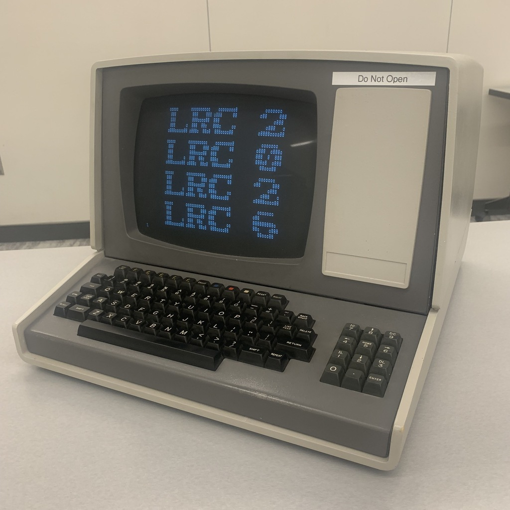
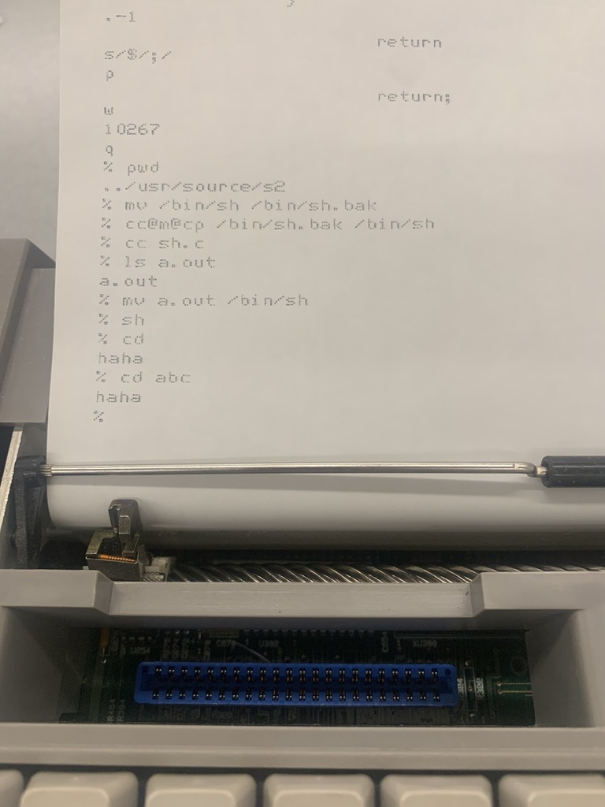
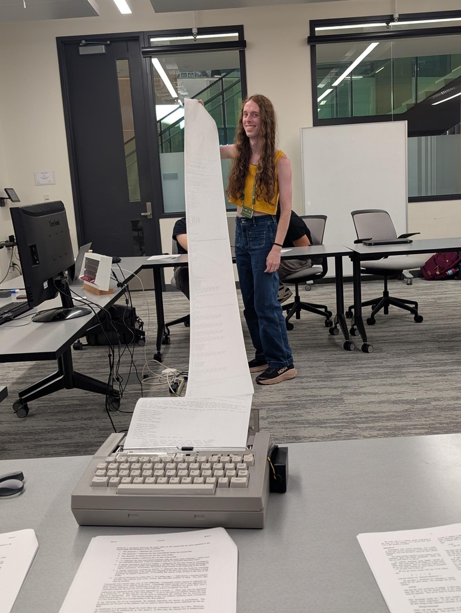
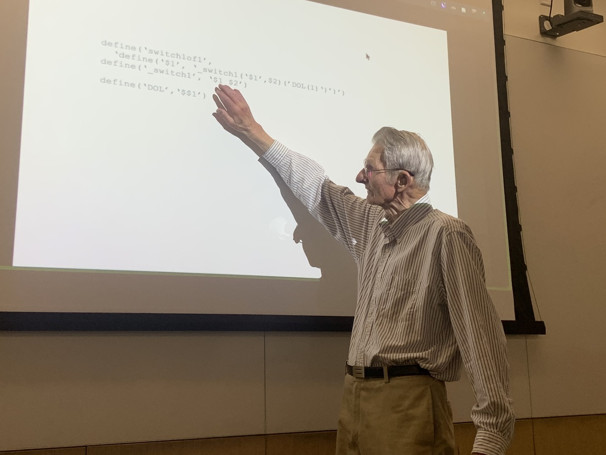
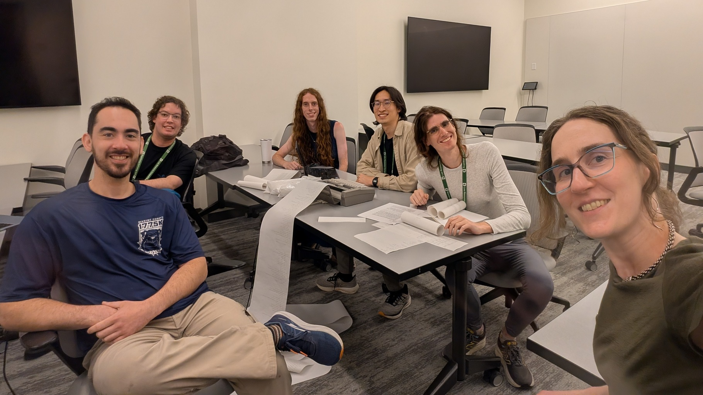

# UNIX V4 workshop at Low Resource Computing

At the [Low Resource Computing](https://lrc.cs.dartmouth.edu) 2026 workshop at
Dartmouth, I hosted an interactive session on UNIX V4. This version of UNIX was
recently recovered from a 1974 magnetic tape found at the University of Utah and
is the earliest complete machine-readable snapshot of UNIX. I taught how to do
software development using the tools of the day, particularly the ed text editor
with a teletype, and participants solved a coding challenge, all signed into the
same machine.

This repository reproduces the [disk image](disk.rk) and [terminal logs](logs/)
from the workshop, as well as my [setup](setup.sh).



## Terminals

Before the workshop, I modified the kernel to support up to 32 simultaneous
terminal connections, raised from the previous 20. It uses 16 KL terminals and
16 DC terminals. I would have also configured 16 DH terminals, bringing the
total up to 48 terminals, the theoretical limit for this version of UNIX, but
the PiDP-11 fork of the SIMH emulator does not support this multiplexer.

I had two physical terminals connected (a Silent 700 teleprinter and a Heathkit
CRT terminal), 29 telnet connections from participants' laptops, as well as the
main console on the PiDP-11.

Find the terminals you used in this list:

<details>
<summary>The logs for each terminal line</summary>

- [KL line 0](logs/kl0.log): main console, `/dev/tty8`
- [DC line 0](logs/dc0.log): TI Silent 700 Model 707/1200, `/dev/tty0`
- [DC line 1](logs/dc1.log): Heathkit H19, `/dev/tty1`
- [DC line 2](logs/dc2.log): port 4002, `/dev/tty2`
- [DC line 3](logs/dc3.log): port 4003, `/dev/tty3`
- [DC line 4](logs/dc4.log): port 4004, `/dev/tty4`
- [DC line 5](logs/dc5.log): port 4005, `/dev/tty5`
- [DC line 6](logs/dc6.log): port 4006, `/dev/tty6`
- [DC line 7](logs/dc7.log): port 4007, `/dev/tty7`
- [DC line 8](logs/dc8.log): port 4008, `/dev/ttya`
- [DC line 9](logs/dc9.log): port 4009, `/dev/ttyb`
- [DC line 10](logs/dc10.log): port 4010, `/dev/ttyc`
- [DC line 11](logs/dc11.log): port 4011, `/dev/ttyd`
- [DC line 12](logs/dc12.log): port 4012, `/dev/ttye`
- [DC line 13](logs/dc13.log): port 4013, `/dev/ttyf`
- [DC line 14](logs/dc14.log): port 4014, `/dev/ttyg`
- [DC line 15](logs/dc15.log): port 4015, `/dev/ttyh`
- [KL line 1](logs/kl1.log): port 4016, `/dev/tty9`
- [KL line 2](logs/kl2.log): port 4017, `/dev/ttyi`
- [KL line 3](logs/kl3.log): port 4018, `/dev/ttyj`
- [KL line 4](logs/kl4.log): port 4019, `/dev/ttyk`
- [KL line 5](logs/kl5.log): port 4020, `/dev/ttyl`
- [KL line 6](logs/kl6.log): port 4021, `/dev/ttym`
- [KL line 7](logs/kl7.log): port 4022, `/dev/ttyn`
- [KL line 8](logs/kl8.log): port 4023, `/dev/ttyo`
- [KL line 9](logs/kl9.log): port 4024, `/dev/ttyp`
- [KL line 10](logs/kl10.log): port 4025, `/dev/ttyq`
- [KL line 11](logs/kl11.log): port 4026, `/dev/ttyr`
- [KL line 12](logs/kl12.log): port 4027, `/dev/ttys`
- [KL line 13](logs/kl13.log): port 4028, `/dev/ttyt`
- [KL line 14](logs/kl14.log): port 4029, `/dev/ttyu`
- [KL line 15](logs/kl15.log): port 4030, `/dev/ttyv`

</details>

I describe my configuration for reproducibility, though the [notes](setup.md)
are mostly intended for myself. I will rework it into a tutorial for configuring
V4–V7 later.

## Getting started

I handed out printed manuals to teach the system in the manner of the day. The
`ed` manuals were particularly helpful. Alex even came back the next day using
`ed` commands I didn't teach, from having read it all. I had also hoped to setup
the `man` command, but didn't get it working in time.

- 15x [ed(I) manual](http://squoze.net/UNIX/v4man/man1/ed.pdf) (V4)
- 10x ["A Tutorial Introduction to the UNIX Text Editor"](http://squoze.net/UNIX/v7/files/doc/04_edtut.pdf) (V7)
- 10x ["UNIX For Beginners"](http://squoze.net/UNIX/v7/files/doc/03_beginners.pdf) (V7)
- 4x [as(I) manual](http://squoze.net/UNIX/v4man/man1/as.pdf) (V4)
- 4x ["Assembler Reference Manual"](http://squoze.net/UNIX/v7/files/doc/28_assembler.pdf) (V7)
- 4x ["Setting Up UNIX"](https://www.tuhs.org/Archive/Applications/Dennis_Tapes/Gao_Analysis/v4_dist/setup.pdf) (V4)

First, we created user accounts for everyone. Since this was accomplished by
editing `/etc/passwd`, I handled this for most people, to avoid people
overwriting others' changes. They were creative with their user IDs.

```
% cat /etc/passwd
root::0:1::/:
bin::3:1::/bin:
thalia::4:4::/usr/thalia:
ben::5:5::/usr/ben:
alex::9:9::/usr/alex:
newt::64:64::/usr/newt:
auberon::18:18::/usr/auberon:
ncb::12:12::/usr/ncb:
joe::88:88::/usr/joe:
cody::25:25::/usr/cody:
hash::31337:31337::/usr/hash:
dnm::55555:55555::/usr/dnm:
ty::1990:1990::/usr/ty:
justin::70:70::/usr/justin:
yang::16::16::/usr/yang:
doug::8:::/usr/doug:
amitb::6:6::/usr/amitb:
voytilla::7:7::/usr/voytilla:
kevin::10:10::/usr/kevin:
michael::30:30::/usr/michael:
bx::42:42::/usr/bx:
hacker::256:256::/usr/hacker:
jordan::69:69::/usr/jordan:
dominic::111:111::/usr/dominic:
```

## Quirks

Perhaps the largest adjustment was that everyone instinctively reached for
backspace to fix typos, but it would instead send a literal ASCII backspace
character. This happened hundreds of times. Early UNIX was designed for printing
terminals and, of course, text cannot be cleared once it's printed on paper.
Instead, it used `#` to erase the last character and `@` to erase the current
line, borrowed from Multics. One participant marveled at how instinctive this
was for me. `amitb` found that the erase character could be configured to
backspace with `stty erase '^h'`, but alas that only worked in later versions of
UNIX.

Another pervasive surface difference was that `cd` was named `chdir` until V7.
Participants ran into `cd: not found` about 100 times.

But by the end, this was no longer a limitation and someone hacked the shell to
laugh at you if you typed `cd`:

```
% cd dir
haha
% ed /usr/source/s2/sh.c
10267
/cd/;/}/p
                if(equal(cp1, "cd")) {
                        prs("haha\n");
                        return;
                }
```



A confusing quirk was that `login` would sometimes use an all-caps mode for
compatibility with the Teletype Model 33. It cycles between terminal settings
until one works, so if you can't sign in, it attempts under all-caps mode. This
was especially prone to happen for the KL terminal sessions. That driver assumes
that the terminal is always connected and doesn't wait for it to be ready, so
the initial `login:` prompt would always be lost. After pressing return, it
would then cycle to the next setting and present an all-caps prompt, making your
whole session uppercase. This happened about 14 times.

```
LOGIN INCORRECT.
NAME: ROOT
# CD /USR
CD: NOT FOUND
# CHDIR /USR
```

## Paper

I brought my TI Silent 700 Model 707/1200 teleprinter to demonstrate computing
on paper. Before the world transitioned to CRT terminals, teletypes printed your
session onto paper. The paper was your monitor and cut/paste was done with
scissors and tape.



Alex was particularly fond of the teletype and was usually found sitting behind
it. Auberon found the long roll of paper so amusing that she will show this
photo of me holding it to her students to show how computing has progressed.

We used up the last bit of paper by printing a meter-long Saturn V rocket ASCII
art, preceded by a countdown of ten beeps. Streaks of red in the paper warned us
of the impending end, and the rocket looked bloodied.

## Challenge

I challenged participants to backport the winning program of the inaugural
International Obfuscated C Code Contest, [mullender.c](https://www.ioccc.org/1984/mullender/),
from UNIX V7 in 1984 to V4 in 1974. It exploits quirks of the early `cc` and
backporting it touches surprisingly deep into the system for something so short.
This was one of the first things I did with UNIX V5, before we recovered V4, so
I figured it could be doable for new users.

This program prints a `:-)` smiley face scrolling across the screen, but is
written in PDP-11 and VAX machine code. It is as follows:

```c
/* Portable between VAX11 && PDP11 */
short main[] = {
        277, 04735, -4129, 25, 0, 477, 1019, 0xbef, 0, 12800,
        -113, 21119, 0x52d7, -1006, -7151, 0, 0x4bc, 020004,
        14880, 10541, 2056, 04010, 4548, 3044, -6716, 0x9,
        4407, 6, 5568, 1, -30460, 0, 0x9, 5570, 512, -30419,
        0x7e82, 0760, 6, 0, 4, 02400, 15, 0, 4, 1280, 4, 0,
        4, 0, 0, 0, 0x8, 0, 4, 0, ',', 0, 12, 0, 4, 0, '#',
        0, 020, 0, 4, 0, 30, 0, 026, 0, 0x6176, 120, 25712,
        'p', 072163, 'r', 29303, 29801, 'e' };
```

I placed the program at [`/usr/thalia/mullender.c`](fs/usr/thalia/mullender.c)
and hints at [`/usr/thalia/hints/`](fs/usr/thalia/hints), then set them loose.

Three users solved the challenge: [`alex`](fs/usr/alex/mullender.c), [`kevin`](fs/usr/kevin/mullender.c),
and [`jordan`](fs/usr/jordan/main.c).

Alex and [Travis](https://github.com/travisgoodspeed) collaborated and used
Travis' HP calculator to convert between bases. Jordan used `dc` (desk
calculator) to perform arithmetic.

```
% dc
_30419
15
-
p
    -30434
q
```

The original uses a non-existent system call to add a delay between prints, but
this doesn't work in V4, as non-existent syscalls trap with
`Bad system call -- Core dumped` instead. The solution involves replacing it
with some other syscall that does not produce an effect. Alex and Kevin matched
what I did, switching it to `getuid`, but Jordan instead chose `smdate`. This
syscall originally would set the modified time of a file, but it was removed, as
it caused issues for tools that observed file times. Its `nullsys` handler has
no effect, but it still consumes an argument, so it skips the `sob` branch and
prints extra fast.

```
% ed /usr/sys/ken/sysent.c
1957
/45/
        0, &nosys,                      /* 45 = tiu */
/getuid/
        0, &getuid,                     /* 24 = getuid */
/smdate/
        1, &nullsys,                    /* 30 = smdate */
```

Alex [scripted](fs/usr/alex/hint3b) the hexadecimal syntax fixes by using the
old behavior of the Thompson shell: Commands that consume stdin would read from
the script file until they exited, so commands and input were interleaved with
no quoting like the later heredocs.

```
% cat /usr/alex/hint3b
ed mullender.c
/0xbef/s//05757/
/0x52d7/s//051327/
/0x4bc/s//02274/
g/0x9/s//011/
/0x7e82/s//077202/
/0x8/s//010/
/0x6176/s//060566/
w
q
% sh hint3b
469
469
% 
```

[`auberon`](fs/usr/auberon/mullender.c), [`bx`](fs/usr/bx/m.c), and [`amitb`](fs/usr/amitb/mullender.c)
successfully backported the syntax changes and [`cody`](fs/usr/cody/temp.c)
almost finished that.

`bx` learned the [`db` debugger](https://github.com/thaliaarchi/unix-v4-demo/blob/main/logs/dc10.log#L3564)
and traced program execution.

`amitb` formatted it artistically:

```c
/* Portable between VAX11 && PDP11 */
int main[] {
        277, 04735, -4129, 25, 0,
    477, 1019, 3055, 0, 12800, -113,
  21119, 21207, -1006, -7151, 0, 1212,
 020004, 14880,               10541,
 2056, 04010,                 4548,
 3044, -6716,                 9, 4407,
 6, 5568,                     1,
 -30460, 0,                   9, 5570,
 512, -30419,                 32386,
 0760, 6, 0, 4, 02400, 15, 0, 4, 1280,
  4, 0, 4, 0, 0, 0, 8, 0, 4, 0, 44,
   0, 12, 0, 4, 0, 35, 0, 020, 0, 4,
    0, 30, 0, 026, 0, 24950, 120,
      25712, 112, 072163, 114,
          29303, 29801, 101
};
```

After this, they had become quite proficient in ed.

## Playing

Besides programming, people also found the games in `/usr/games`. Hunt the
Wumpus was rather popular and someone discovered a difference in `bj` from the
traditional Blackjack rules.

```
% /usr/games/wump
Instructions? (y-n) y

Welcome to 'Hunt the Wumpus.'

The Wumpus lives in a cave of 20 rooms.
Each room has 3 tunnels leading to other rooms.
```

## A legend

Doug McIlroy visited on the third day of the workshop. He was the first-ever
UNIX user, and responsible for it growing beyond the initial research group. He
gave [a talk](https://discuss.systems/@thalia/117123655247685214) on bare m4, a
single-operation version of the m4 macro processor with only `define`, which is
nonetheless Turing-complete.



Afterwards, he setup an account, `doug`, for himself on UNIX V4. He was
accustomed to later versions of ed that allow omitting the closing slashes and
the later passwd format, but he still had the muscle memory.

We chatted about the early years of UNIX: They used a Teletype Model 33 ASR as
the console teletype until the end, even though they didn't use it for
programming, as a hardcopy terminal was useful. Ken and Dennis worked at night,
out of his sight, and although they had terminals setup at home, they worked
better together and dutifully came into the Labs. Early UNIX distributions were
produced with the GE 635, since it had a magtape drive, but the PDP-11 didn't.
Bob Morris and Ken wrote a program that printed a million digits of e and used a
roll of paper. Doug's speech synthesizer wasn't widely distributed, but I
pointed out that V4 had a Screw Works driver. Doug wrote the roff for Multics.

It was a privilege sharing a UNIX system with Doug. Since research progressed so
quickly, this would have been the first time in 52 years that he had used this
version of UNIX.

## Hacking

[Ben](https://kallus.org) was particularly curious about the limits of the user
and group IDs and changed his several times.

```
ben::5:5::/usr/ben:
ben::65535:65535::/usr/ben:
ben::-1-1::/usr/ben:
hacker::256:256::/usr/hacker:
```

He first tried unsigned -1, then signed -1. He hypothesized that it simply used
`scanf`, so a sign would be accepted, but the parsing was simpler than that and
still produced a usable uid. However, his entry was missing a colon, so he
couldn't sign in anyways.

```
% ed /usr/source/s1/login.c
2884
/uid =/;.+2p
        uid = 0;
        while (*np != ':')
                uid = uid*10 + *np++ - '0';
```

After reading the shell source, he realized that any uid equal to 0 mod 256 was
a super user, so he made an account with a uid of 256 and was treated as root.

```
% ed /usr/source/s2/sh.c
10267
/acname =/;/}/p
        acname = "/usr/adm/sh_acct";
        promp = "% ";
        if(((uid = getuid())&0377) == 0) {
                promp = "# ";
                acname = "/usr/adm/su_acct";
        }
q
% ^D
login: hacker
# 
```

## Messaging

We had at least 11 users active simultaneously, though there were probably more
at other times:

```
# who
root    tty0 Aug 18 10:36
ty      tty1 Aug 18 10:52
hash    tty2 Aug 18 10:50
root    tty8 Aug 18 10:53
ty      ttyc Aug 18 10:54
newt    ttyk Aug 18 10:43
cody    ttyl Aug 18 10:48
alex    ttym Aug 18 10:48
newt    ttyn Aug 18 10:39
dnm     ttyq Aug 18 10:49
ncb     ttyt Aug 18 10:43
```

Some messaged themselves:

```
# write root

␇␇␇Message from root...
hiiiiiii
hiiiiiii
```

and to others:

```
# 
␇␇␇Message from alex...
hey! what ar you doing???
EOT

# 
# write alex
{not much!!! hacking the planet)
# 
```

Mail was sent:

```
% mail kevin
is this thEOT
ing on

% 
```

and I wrote directly to others' terminal devices:

```
% who
% cat > /dev/tty1
hello
how
are
you
% 
```

## Finishing

By the end, we had become acquainted with the system, learned `ed`, programmed a
bit in C, played some games, mailed each other, and used up a whole roll of
paper. Great success!


